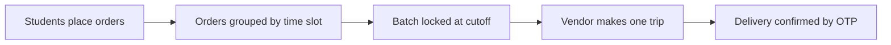

# Hi, I'm Karan 👋

### Full Stack Engineer who enjoys the backend side of things

 

---

### 🧭 About

I'm a final-year CSE student at **NIT Arunachal Pradesh**. I like building things people actually use, and making sure they keep working once they're live.

- 🏗️ Built my college's **official website** and a **campus delivery platform**, both running on our own servers
- 🤖 Currently exploring **AI tools that understand codebases**
- 🤝 Former President of **[Coding Pundit(2025-2026)](https://github.com/coding-pundit-nitap)**, the institute coding club
- 🎯 Open to **full-time Software Engineering roles** (2027 graduate)

---

### 🚀 Featured Work

#### 🏔️ [Campus Connect](https://github.com/coding-pundit-nitap/campus-connect) · [live ↗](https://connect.nitap.ac.in)
Our hostels sit ~100 m uphill from the market, so vendors had to climb once for every single order. Campus Connect groups orders into time slots so a vendor makes **one trip for many orders**, with OTP-verified delivery.

- Handles up to **500 orders/min** without duplicate or lost orders
- Fast lookups (**under 50 ms**) and live notifications for students and vendors
- Self-hosted with full monitoring and alerts

`Next.js` `PostgreSQL` `Redis` `BullMQ` `Docker` `Nginx`

#### 🤖 [AEIA - AI Engineering Intelligence Assistant](https://github.com/krotrn/campus-connect-ai)
Ask questions about a large codebase in plain English and get answers that cite the exact code they came from.
- Finds the right code for **every query** in its test set, with **zero hallucinated answers** in evaluation
- Can also answer questions about git history, code changes, and file dependencies

`Python` `FastAPI` `LangGraph` `Qdrant` `Gemini`

#### 🏛️ NIT Arunachal Pradesh - Official Website · [live ↗](https://www.nitap.ac.in)
Led an 8-member team during my internship to build the college's website and admin portal.
- Each department can edit only its own pages, without needing full admin access
- Protected against abuse with rate limiting, and backed by tested backup and recovery scripts

`Next.js` `Fastify` `PostgreSQL` `Docker` `Nginx`

#### 📡 [apsta](https://github.com/krotrn/apsta)
A Linux tool that lets you stay on Wi-Fi and share a hotspot at the same time.

`Python` `Linux`

#### 💬 Real-time Chat - [client](https://github.com/krotrn/Chat_App) · [backend](https://github.com/krotrn/ChatApp-backend) · [live ↗](https://chat-kr.vercel.app)
A messaging app with group chats, reactions, read receipts, and file sharing.

`Node.js` `Socket.IO` `MongoDB` `Next.js`

---

### 💼 Experience

| Role | Where | When |
|---|---|---|
| Software Engineering Intern | NIT Arunachal Pradesh | Dec 2025 – May 2026 |
| Full Stack Developer Intern | Smallbus (AR Group Co.) · Remote | Jun 2025 – Aug 2025 |
| President | Coding Pundit, NIT AP | Aug 2025 – Aug 2026 |

---

### 🛠️ Toolbox

  <b>Languages</b> 
  

  <b>Backend & Data</b> 
  

  <b>Infra & DevOps</b> 
  

  <b>Frontend</b> 
  

Also: BullMQ · MinIO (S3) · Socket.IO · SSE · LangGraph · Qdrant · RBAC · Pub/Sub

---

### 🏆 Highlights

- 🥇 **Winner, CAN Hackathon (NERIST)** - built a working delivery MVP in 6 hours.
- 🧠 **Amazon ML Summer School 2026** - selected in the top 3,000 out of 1.3 lakh+ applicants
- ⚔️ **LeetCode Knight** - rating 1857 (top ~6%), 700+ problems solved
- ⭐ 90+ stars across open-source projects

---

### 📈 Activity

  
  
   
  

---

**Let's build something together.**
[karan.ks.dev@gmail.com](mailto:karan.ks.dev@gmail.com) · [krotrn.vercel.app](https://krotrn.vercel.app)

