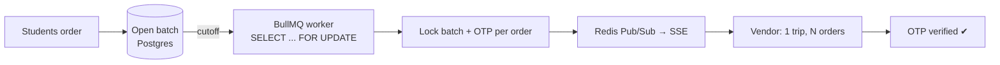

# Hi, I'm Karan 👋

### Backend-leaning Full Stack Engineer · I build systems that run in production

 

---

### 🧭 About

I'm a final-year CSE student at **NIT Arunachal Pradesh** who likes the unglamorous parts of software: row locks, job queues, rate limits, backups, and the dashboards that tell you something broke before users do.

- 🏗️ Shipped my college's **official website + CMS** and a **campus delivery platform** — both self-hosted on institutional servers
- 🧠 Recently building **AI tooling for codebases**: hybrid retrieval, agentic routing, MCP servers
- 🤝 Former President of **[Coding Pundit(2025-2026)](https://github.com/coding-pundit-nitap)**, the institute coding club
- 🎯 Open to **full-time Software Engineering roles** (2027 graduate) — backend, platform, or full stack

---

### 🚀 Featured Work

#### 🏔️ [Campus Connect](https://github.com/coding-pundit-nitap/campus-connect) · [live ↗](https://connect.nitap.ac.in)
**The problem:** hostels sit ~100 m uphill from the market. 10 orders meant 10 climbs for a vendor, coordinated over WhatsApp.
**The fix:** a *Batch & Climb* marketplace — orders collect into time-slot batches, a worker locks the batch at cutoff, and the vendor makes **one trip for N orders**, handing over with per-order OTPs.

- Race-free batch locking at up to **500 orders/min** using deterministic-order pessimistic row locks inside transactions (no deadlocks, no double-processing)
- **29-model** PostgreSQL schema with composite + partial indexes → **sub-50 ms** lookups on hot paths
- Real-time notifications: SSE over Redis Pub/Sub, Last-Event-ID replay on reconnect, DLQ with exponential backoff
- **15+ services** in Docker Compose: Nginx, workers, MinIO, Prometheus, Grafana, Loki, Alertmanager

`Next.js 16` `TypeScript` `PostgreSQL` `Prisma` `Redis` `BullMQ` `Docker` `Nginx` `MinIO`

#### 🤖 [AEIA — AI Engineering Intelligence Assistant](https://github.com/krotrn/campus-connect-ai)
Ask questions about a ~94k LOC codebase and get answers with verified citations.
- Hybrid retrieval: BGE-small dense + BM25 sparse, fused with weighted RRF (70/30) → **100% Recall@5**, 0.79 MRR on a 20-query golden set
- **100% faithfulness / 0% hallucination** on an LLM-as-judge RAG Triad eval
- LangGraph router across 4 tools (code search, git history, commit diff, dependency graph), SSE streaming at **<400 ms TTFT**
- Exposed as an **MCP server**; webhook-driven incremental re-indexing with a build-then-swap BM25 hot reload

`FastAPI` `LangGraph` `Qdrant` `Gemini` `Tree-sitter` `Next.js`

#### 🏛️ NIT Arunachal Pradesh — Official Website & CMS · [live ↗](https://www.nitap.ac.in)
Software Engineering Intern, Dec 2025 – May 2026. Led an 8-member team.
- Hybrid access control: system/department roles **+ per-route resource ACLs**, so staff edit only their own pages across 60+ pages
- One monorepo, two rendering strategies: static/ISR public site, SSR admin portal, Fastify REST API
- Nginx with **5 route-scoped rate-limit zones** (1 req/s on auth); disaster-recovery runbooks + 1,000+ lines of backup/restore/verify scripts

`Next.js` `Fastify` `PostgreSQL` `Prisma` `Nginx` `Docker` `MinIO`

#### 📡 [apsta](https://github.com/krotrn/apsta)
Linux CLI that keeps you on Wi-Fi **and** broadcasts a hotspot at the same time. Parses `iw list` interface combinations to pick a strategy (nmcli virtual interface, or hostapd + dnsmasq + NAT for cards like the Intel AX200).

`Python` `Linux networking` `hostapd` `iptables`

#### 💬 Real-time Chat — [client](https://github.com/krotrn/Chat_App) · [backend](https://github.com/krotrn/ChatApp-backend) · [live ↗](https://chat-kr.vercel.app)
Decoupled Socket.IO backend with direct/group chats, reactions, read receipts and attachments. PostgreSQL for users, MongoDB for message history; client handles reconnection with backoff and optimistic updates.

`Node.js` `Express` `Socket.IO` `MongoDB` `PostgreSQL` `Next.js` `Redux Toolkit`

---

### 💼 Experience

| Role | Where | When |
|---|---|---|
| Software Engineering Intern | NIT Arunachal Pradesh | Dec 2025 – May 2026 |
| Full Stack Developer Intern | Smallbus (AR Group Co.) · Remote | Jun 2025 – Aug 2025 |
| President | Coding Pundit, NIT AP | Aug 2025 – Aug 2026 |

---

### 🛠️ Toolbox

  <b>Languages</b> 
  

  <b>Backend & Data</b> 
  

  <b>Infra & DevOps</b> 
  

  <b>Frontend</b> 
  

Also: BullMQ · MinIO (S3) · Socket.IO · SSE · LangGraph · Qdrant · RBAC · Pub/Sub

---

### 🏆 Highlights

- 🥇 **Winner, CAN Hackathon (NERIST), Mar 2025** — shipped a logistics MVP in 6 hours; it became the seed of Campus Connect
- 🧠 **Amazon ML Summer School 2026** — selected in the top 3,000 of 1,34,421 applicants
- ⚔️ **LeetCode Knight** — contest rating 1857 (top ~6%), 700+ problems
- ⭐ 90+ stars across open-source projects

---

### 📈 Activity

  
  
   
  

---

**Building something with hard backend problems? Let's talk.**
[karan.ks.dev@gmail.com](mailto:karan.ks.dev@gmail.com) · [krotrn.vercel.app](https://krotrn.vercel.app)

